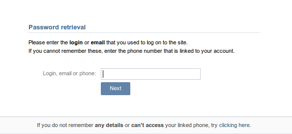

#Формы

Основной тип форм на данном сайте выражен в следующем виде:
(Форма входа и регистрации разделены)

(Форма входа и регистрации в одном окне)

Первый случай для рассмотрения это "2":

Нас интересует div с идентификатором "quick_login".

	    

	      

	  <form method="POST" name="login" id="quick_login_form" action="https://login.vk.com/?act=login" onsubmit="if (vklogin) {return true} else {quick_login();return false;}">
	    <input type="hidden" name="act" value="login" />
	    <input type="hidden" name="role" value="al_frame" />
	    <input type="hidden" name="expire" id="quick_expire_input" value="" />
	    <input type="hidden" name="captcha_sid" id="quick_captcha_sid" value="" />
	    <input type="hidden" name="captcha_key" id="quick_captcha_key" value="" />
	    <input type="hidden" name="_origin" value="index.html" />
	    <input type="hidden" name="ip_h" value="37fe515d56cd7fc4c1" />
	    <input type="hidden" name="lg_h" value="fa95ee332be043e45c" />
	    
Phone or email

	    
<input type="text" name="email" class="text" id="quick_email" />

	    
Password

	    
<input type="password" name="pass" class="text" id="quick_pass" onkeyup="toggle('quick_expire', !!this.value);toggle('quick_forgot', !this.value)" />

	    <input type="submit" class="submit" />
	  </form>
	  <button class="flat_button button_wide button_big" id="quick_login_button">Log in</button>
	  <button class="flat_button button_wide button_big" id="quick_reg_button" style="" onclick="top.showBox('join-2.html', {act: 'box', from: nav.strLoc})">Sign up</button>
	  
<a id="quick_forgot" href="restore.html" target="_top">Forgot your password?</a>

Don&#39;t remember me

	

